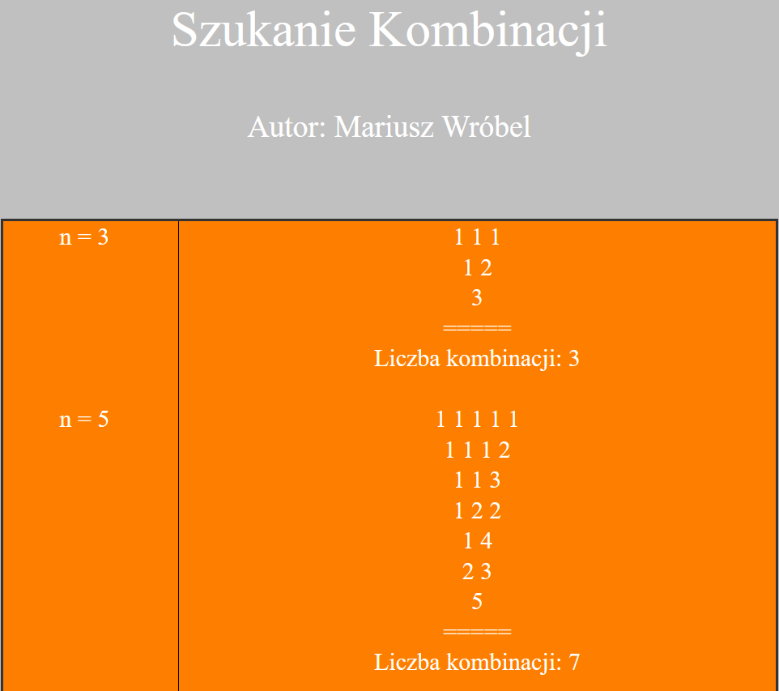

Combination finder

    
    

    
Program operation:
We start by opening the script.bat application. To run the algorithm
select the appropriate option. After selecting the appropriate option, the app.py script is launched, 
which takes data from the appIn.txt file and processes it.
After processing, the script operation effect is saved in the appOut.txt file. Then
the web.py script is run which gets the data from the appOut.txt file and creates the HTML code which
opens in the web browser.
